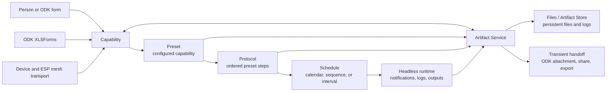

# MethodMesh

MethodMesh is an Android fieldwork and practical-methods toolkit. It turns small, focused capabilities into reusable actions that can be run by a person, called from an ODK form, chained into a protocol, or scheduled for headless execution.

> **Work in progress — alpha release.** Interfaces, capability contracts, data formats, and module names are still being refined. This repository is useful for experimentation and development; it is not yet a stable production release.

## What it does

MethodMesh brings common field and everyday tasks into one composable runtime:

- capture measurements, observations, media, documents, locations, text, and sensor readings;
- run small capabilities directly from the dashboard or from another capability;
- save a configured capability as a **preset**;
- combine presets into a **protocol** with ordered steps and output handling;
- run a protocol manually, from ODK, or through a **schedule**;
- run scheduled presets in headless mode, including notifier and log-producing workflows;
- pass artifacts between capabilities without forcing every intermediate file into persistent storage;
- keep persistent files, logs, backups, exports, and module-owned ODK templates in the shared Files/Artifact layer;
- connect to devices and experimental ESP-NOW mesh nodes through the transport and sensor framework.

## How the pieces connect



The important distinction is between an **artifact** and a saved file. A capability can receive a document, produce a signed PDF, and hand it to ODK or another capability without silently creating a permanent copy. A preset may opt into a persistent log when a workflow needs history.

## Presets, protocols, and schedules

### Capabilities

A capability is one useful operation with a stable AS1.00 method contract. It declares its inputs, outputs, settings, and optional Android UI. Capabilities can be launched from the dashboard, invoked through Android intents, or called by another workflow.

### Presets

A preset stores a capability ID and its chosen settings. It is the reusable unit for a common task: for example, “Jeff’s running log”, “sign consent PDF”, or “take an AHT reading”. Presets can be run interactively or configured to save results to a persistent log.

### Protocols

A protocol is an ordered chain of presets. Each step can be configured for transient or saved output, and the protocol closeout can share, copy, export, or pass results onward. Protocols are useful when a task has several deliberate stages.

### Schedules

Schedules are JSON-backed bundles of one or more cron tasks. A task can invoke a notification, preset, protocol, capability, form, or other external action. Each bundle has an explicit initiation point: manual, absolute, event-triggered, or triggered by a preset. Relative tasks can wait for an offset such as “15 days after this preset”, then run a normal cron expression. Retries, follow-ups, multiple aligned tasks, and headless execution are supported. A schedule can run unattended and append results to a preset’s log.

## ODK and external invocation

ODK forms can invoke MethodMesh capabilities using the shared intent and return contract. A form can request a capability, receive its structured result, and attach an artifact such as a photo, signed document, or generated report. The same capability may be launched from the dashboard, a protocol, a schedule, or another Android application.

Module-owned XLSForms remain in their module folders as the canonical source. The build discovers them and generates an indexed asset catalogue for fast runtime lookup; generated assets are a cache and are never the source of truth.

## Current module areas

The repository currently contains modules covering:

- **Field measurement and science:** acoustics, aquatic fieldwork, astronomy, diving, earth science, electrical work, surveying, spatial geometry, visual acuity, calibrated scales, and clinical instruments.
- **Documents and evidence:** reference library, document scanning, digital signing, image annotation/redaction, magnifier, trusted timestamps, text tools, media capture, and Paper Bridge.
- **Forms and data:** ODK form launcher, data tools, field statistics, scoring, sampling, question primitives, conversions/calculator tools, and online API GET.
- **Location, identity, and communication:** compass, Plus Codes, GPS target navigation, QR/barcodes, NFC, SMS, Bluetooth inspection/printing, amateur radio, network tools, and Web Actions.
- **Sensors and hardware:** ESP32 sensor framework, ESP-NOW mesh transport, sensor reading, sensor provisioning and firmware installation, device services, and the workbench.
- **Language, vision, and audio:** ML Kit translation and vision, conversation translation, speech transcription, sound generation, music tools, and media services.
- **Practical and experimental tools:** chance/random number generation, multi-counter, psychomotor vigilance, expenses, emergency tools, aviation, geocaching, GameDeck, Tamagotchi Lab, Signals, Time & Alarms, and the current experimental modules under active development.

Modules are self-contained under `app/src/main/java/com/example/methodmesh/modules/<module>/`. They own their implementation, documentation, settings contributions, and ODK examples. The host discovers modules through the shared module contract rather than hard-coding module-specific UI.

## Repository guide

- `app/src/main/java/com/example/methodmesh/core/` — shared runtime, artifacts, protocols, scheduling, and transport contracts.
- `app/src/main/java/com/example/methodmesh/modules/` — capability modules and module-owned documentation/examples.
- `app/src/main/java/com/example/methodmesh/ui/` — dashboard, Files, ODK catalogue, settings, and shared UI.
- `app/src/main/assets/methodmesh/` — generated runtime indexes and packaged assets.
- `firmware/` — ESP32 firmware and mesh-related development material.
- `docs/METHODMESH_MASTER_BOOK.md` — the canonical architecture and governance reference.

## Building

Open the project in Android Studio or run the standard Gradle build:

```bash
./gradlew :app:assembleDebug
```

The app is developed and tested as an Android application. Some integrations, including ODK Central, KoboToolbox, device transports, and ESP mesh hardware, require their corresponding services or physical devices.

## Documentation

Start with the [MethodMesh Master Book](docs/METHODMESH_MASTER_BOOK.md). Module-specific documentation and XLSForm examples live beside the code that owns them.
