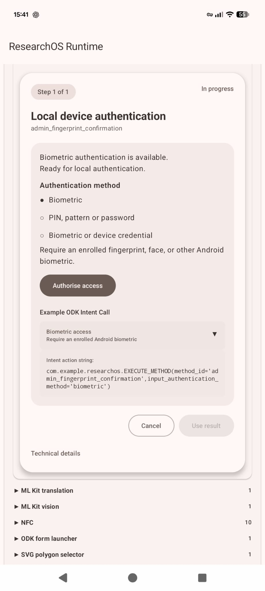
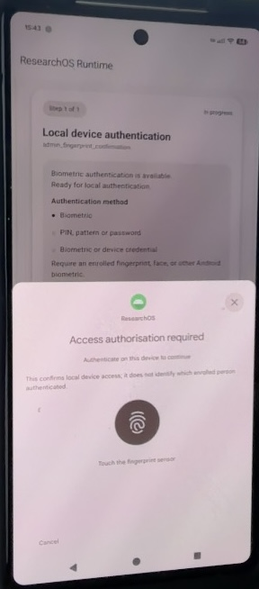
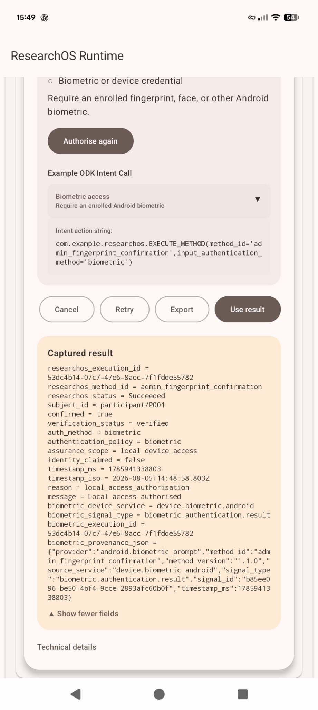

::: {.status-box .status-complete}
**Status: Documented and demonstrated**

This status is based on the supplied project documentation and example XLSForms. It is not a formal validation claim.
:::

## Purpose

Request Android biometric or device-credential authentication and return a transient local-access decision.

This is not an identity attestation but can be used to prevent unauthorised users from accessing a form. by placing XLSForm questions inside a required local device authentication step, progress to study questions will only be allowed for registered users of the device.

## Capability IDs

- `admin_fingerprint_confirmation`

## Requirements

- Android device with an enrolled biometric or device credential.

## Screenshots

{width="250"} {width="250"} {width="250"}

## Supported XLSForm calls

**From `example_odk_admin_fingerprint_confirmation.xlsx`:**

``` text
com.example.researchos.EXECUTE_METHOD(method_id='admin_fingerprint_confirmation',input_authentication_method=${authentication_method})
```

## Inputs observed in supplied examples

| Field                 | Label                 | XLSForm type           |
|-----------------------|-----------------------|------------------------|
| authentication_method | Authentication policy | select_one auth_policy |

## Expected returned fields

Return fields are documented from the specific XLSForm execution group only.

The previous generated documentation layer contained duplicated fields across capabilities. This section has been regenerated and will only include verified fields from the matching execution group.
