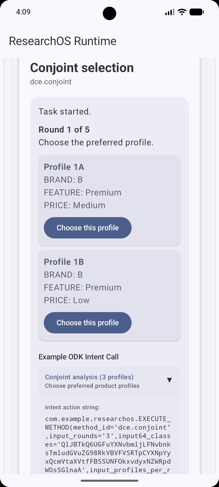
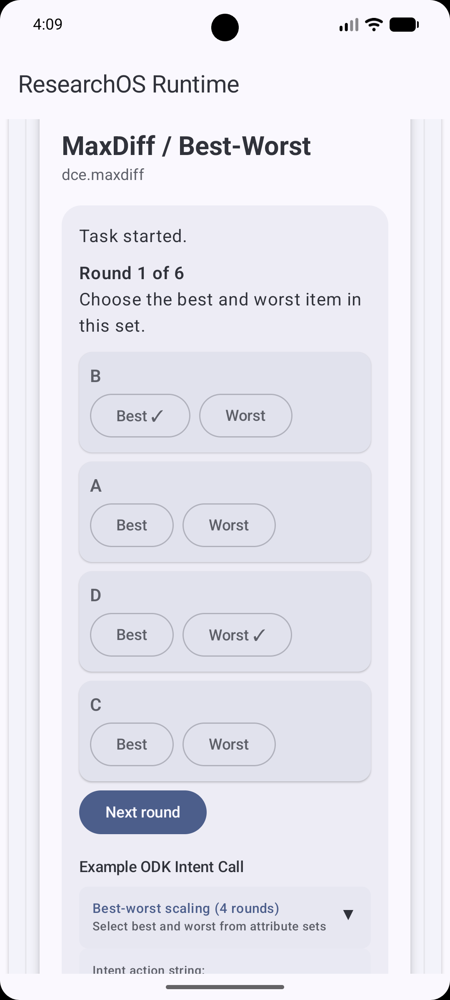
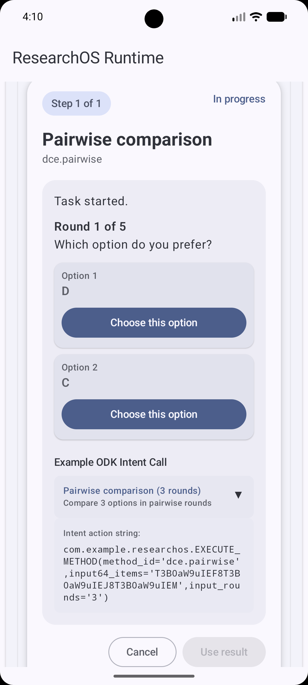
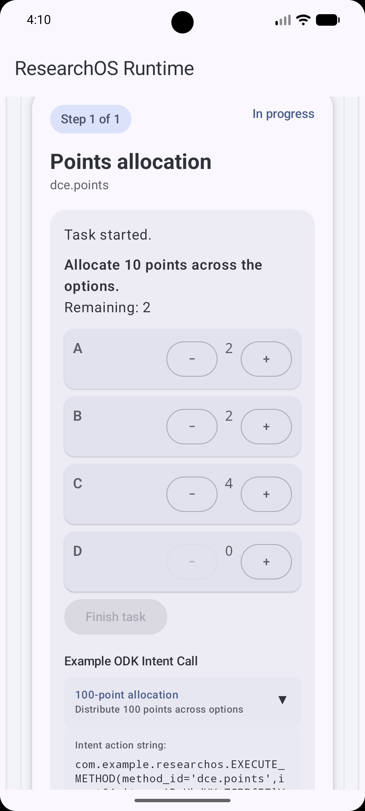
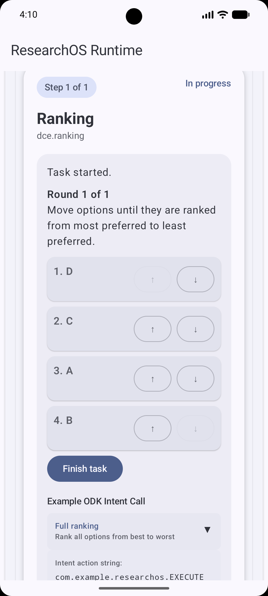

::: {.status-box .status-complete}
**Status: Documented and demonstrated**

This status is based on the supplied project documentation and example XLSForms. It is not a formal validation claim.
:::

## Purpose

Run interactive pairwise, MaxDiff, ranking, points-allocation and conjoint choice tasks.

## Capability IDs

- `dce.pairwise`
- `dce.maxdiff`
- `dce.ranking`
- `dce.points`
- `dce.conjoint`

## Requirements

- No additional requirement is stated beyond the installed ResearchOS application.

## Screenshots

{width=250} {width=250} {width=250} {width=250} {width=250}

## Supported XLSForm calls

**From `example_odk_dce.pairwise.xlsx`:**

``` text
com.example.researchos.EXECUTE_METHOD(method_id='dce.pairwise',input_rounds='5',input64_items='UGFuYXNvbmljClNvbnkKTmludGVuZG8KU2Ftc3VuZw',input_seed='participant_001',return_mode='flat')
```

**From `example_odk_dce.maxdiff.xlsx`:**

``` text
com.example.researchos.EXECUTE_METHOD(method_id='dce.maxdiff',input_rounds='6',input_items_per_round='4',input64_items='UmVsaWFibGUKQWZmb3JkYWJsZQpGYXN0CkZhbWlsaWFyClBvcnRhYmxlCkR1cmFibGU',input_seed='participant_001',return_mode='flat')
```

**From `example_odk_dce.ranking.xlsx`:**

``` text
com.example.researchos.EXECUTE_METHOD(method_id='dce.ranking',input_rounds='3',input64_items='Q2xpbmljIEEKQ2xpbmljIEIKQ2xpbmljIEMKQ2xpbmljIEQ',input_seed='participant_001',return_mode='flat')
```

**From `example_odk_dce.points.xlsx`:**

``` text
com.example.researchos.EXECUTE_METHOD(method_id='dce.points',input_points='100',input64_items='UHJldmVudGlvbgpUcmVhdG1lbnQKVHJhaW5pbmcKVHJhbnNwb3J0',input_seed='participant_001',return_mode='flat')
```

**From `example_odk_dce.conjoint.xlsx`:**

``` text
com.example.researchos.EXECUTE_METHOD(method_id='dce.conjoint',input_rounds='6',input_profiles_per_round='2',input64_classes='QlJBTkQ6IFBhbmFzb25pYywgU29ueSwgTmludGVuZG8KRkVBVFVSRTogQmFzaWMsIFNtYXJ0LCBQcmVtaXVtClBSSUNFOiAxMDAsIDIwMCwgMzAw',input_seed='participant_001',return_mode='flat')
```

## Inputs observed in supplied examples

| Field | Label | XLSForm type |
|-------|-------|--------------|
| start |       | start        |

## Expected returned fields

Return fields are documented from the specific XLSForm execution group only.

The previous generated documentation layer contained duplicated fields across capabilities. This section has been regenerated and will only include verified fields from the matching execution group.
