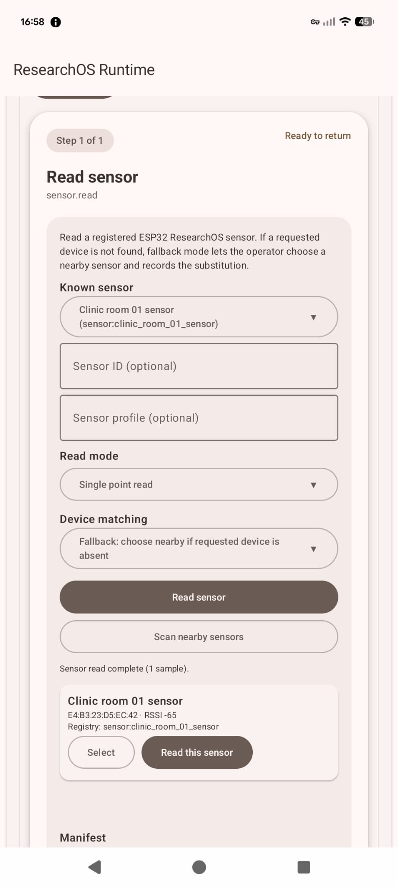
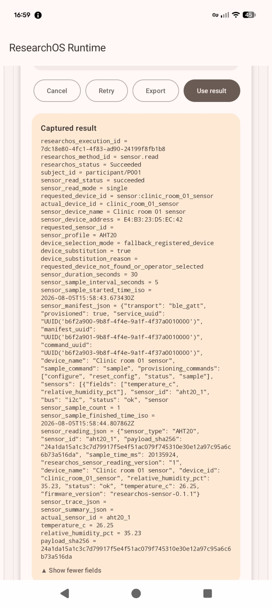

::: {.status-box .status-complete}
**Status: Documented and demonstrated**

This status is based on the supplied project documentation and example XLSForms. It is not a formal validation claim.
:::

## Purpose

Read, trace, average or discover registered ResearchOS BLE sensor nodes.

## Capability IDs

- `sensor.read`

## Requirements

- Compatible sensor node.
- Bluetooth permissions.

## Screenshot

{width=250} {width=250} {width=250}


## Supported XLSForm calls

**From `example_odk_sensorread.xlsx`:**

``` text
com.example.researchos.EXECUTE_METHOD(method_id='sensor.read',input_device_id=${config_device_id},input_sensor_id=${config_sensor_id},input_sensor_profile=${config_sensor_profile},input_sensor_read_mode=${config_read_mode},input_duration_seconds=${config_duration_seconds},input_sample_interval_seconds=${config_interval_seconds},input_device_match_policy=${config_match_policy},return_mode='flat')
```

## Inputs observed in supplied examples

| Field                   | Label                      | XLSForm type            |
|------------------------|------------------------|------------------------|
| config_read_mode        | Read mode                  | select_one read_mode    |
| config_device_id        | Registered device ID       | text                    |
| config_sensor_id        | Sensor ID                  | text                    |
| config_sensor_profile   | Sensor profile             | text                    |
| config_match_policy     | Device matching policy     | select_one match_policy |
| config_duration_seconds | Duration in seconds        | integer                 |
| config_interval_seconds | Sample interval in seconds | integer                 |

## Expected returned fields

Return fields are documented from the specific XLSForm execution group only.

The previous generated documentation layer contained duplicated fields across capabilities. This section has been regenerated and will only include verified fields from the matching execution group.
