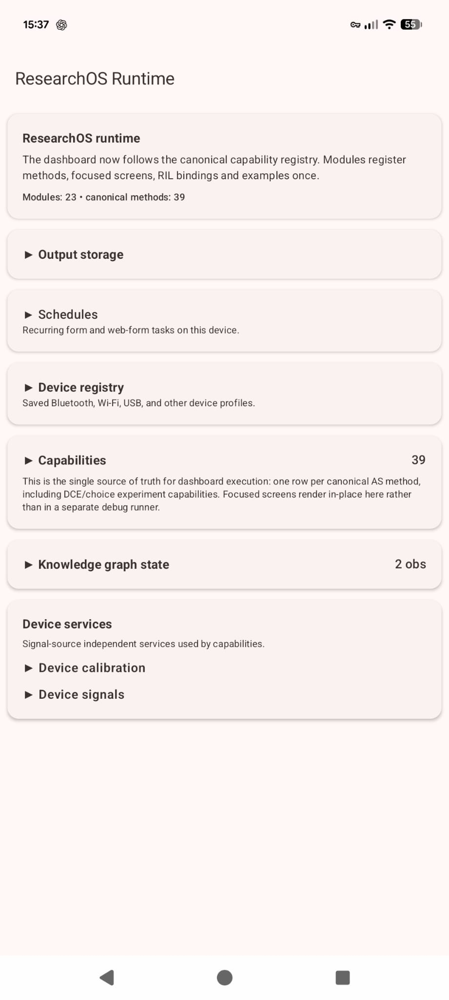
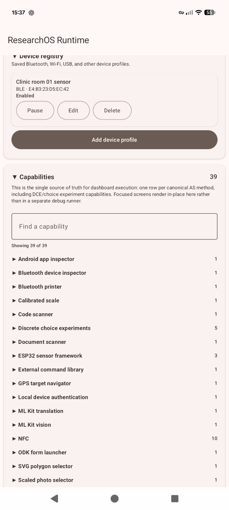
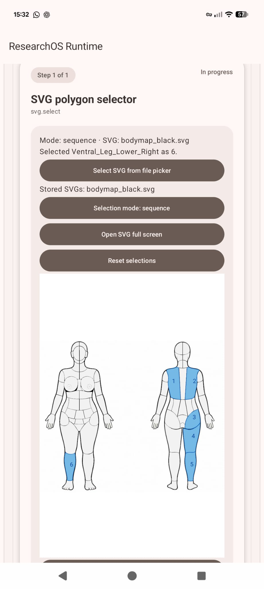
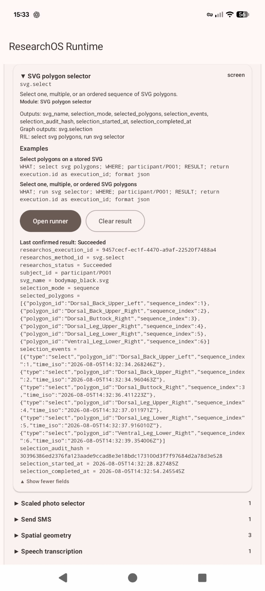
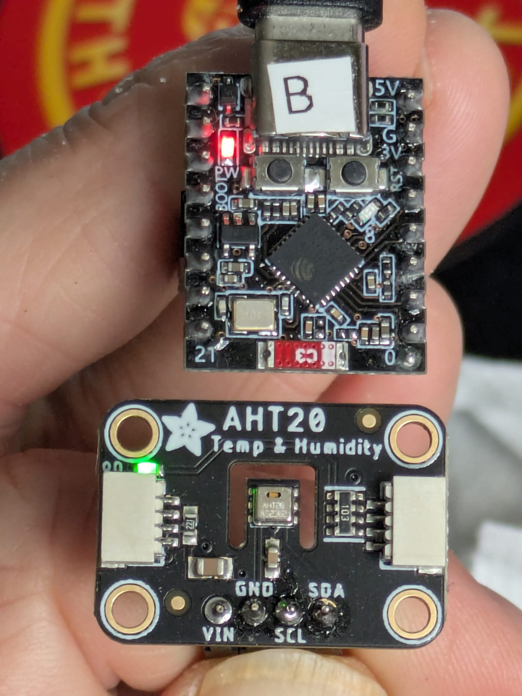
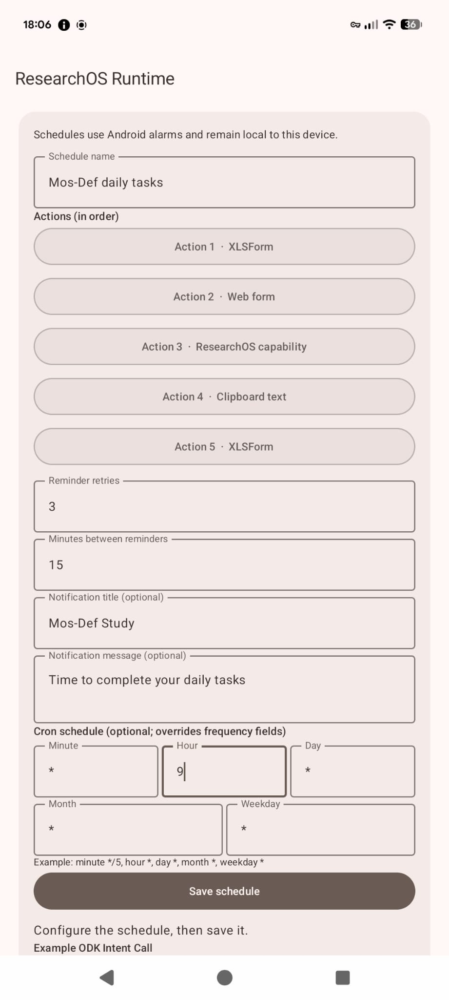

::: hero-banner
# ResearchOS

## Extend XLSForm workflows with offline Android capabilities

ResearchOS is a capability layer that allows XLSForm-based research workflows to access specialist Android functions while keeping the electronic data capture system as the source of the research record.

It connects forms to identity verification, sensors, instruments, maps, communication tools, machine learning, external applications and field devices through a common execution framework.

[Get started](getting-started.qmd){.btn .btn-primary .btn-lg}
[Browse capabilities](capabilities/index.qmd){.btn .btn-secondary .btn-lg}
:::

## Screenshots

{width="250"} {width="250"} {width="250"} {width="250"}


## What ResearchOS does

```text
XLSForm / EDC
    → ResearchOS capability request
    → Android function, sensor, device or application
    → structured result
    → calling form
```

ResearchOS does not aim to replace an EDC system. Instead, it acts as a bridge between research workflows and the rapidly expanding capabilities available on modern Android devices.

---

## Capability domains

## Identity, trust and provenance

Research data often requires evidence that an event happened at a particular time, on a particular device, by an authorised person.

ResearchOS provides building blocks for:

- device-authenticated actions;
- biometric or device credential confirmation;
- cryptographic attestation;
- NFC-based identity workflows;
- QR-based verification;
- traceable execution metadata.

These capabilities support stronger evidence chains for research activities without requiring continuous connectivity.

[Explore identity and attestation →](capabilities/index.qmd)

#### ODK Form performing a biometrically signed attestation of data with RFC 3161 trusted timestamp policy
{width="350"} 
---

## Sensors and connected instruments

ResearchOS provides a bridge between XLSForm workflows and physical measurement devices.

The built-in sensor ecosystem supports:

- BLE sensor discovery;
- generic sensor registration;
- ESP32-based research devices;
- provisioning of compatible sensor nodes;
- reading measurements from field hardware;
- future expansion through standard sensor contracts.

The goal is not to create a single instrument, but a reusable framework for connecting research workflows to low-cost hardware.  

#### AHT20 Temperature/Humidity sensor flashed and provisioned by ResearchOS

{width="250" }  

#### ODK Form collecting data from AHT20 sensor via ResearchOS
{width="350" } 

---

## New digital research instruments

ResearchOS extends the types of measurements that can be collected through standard field workflows.

Examples include:

- discrete choice experiments;
- calibrated visual scales;
- SVG-based anatomical or spatial selectors;
- timed and sequenced interactions;
- structured behavioural inputs.

These capabilities allow richer research instruments to be deployed through familiar XLSForm architectures.

---

## NFC, QR codes and physical-world interaction

ResearchOS connects digital records with physical objects.

Supported workflows include:

- QR and barcode scanning;
- NFC tag reading and writing;
- credential provisioning;
- specimen and asset identification;
- protocol step verification;
- physical object linking.

These capabilities are especially useful where field workflows involve samples, equipment, participants or locations.

---

## Scheduling and automated research workflows

ResearchOS can act as a local workflow engine for devices.

Examples include:

- scheduled form launches;
- recurring research activities;
- reminders;
- timed data collection tasks;
- chained and bundled events;
- local execution triggers.

This allows field devices to continue supporting research activities without relying on constant server communication.

ResearchOS can also run configured capability presets and named protocols directly from the app. Test runs are separated from real saved output: **Test** previews the result without writing a study package, while **Test and save** writes the normal JSON-plus-attachments output package. Each card keeps a visible last-result preview so operators can inspect returned fields and image media before using a workflow operationally.


#### A system notification leads to a chain of events (ODK Collect form and Enketo Webform) are scheduled for completion at a prespecified time
{width="350"}  
{width="350"} 

---

## Communication from the field

ResearchOS can connect research workflows to device communication functions.

Examples include:

- automated SMS sending;
- structured messaging workflows;
- future integration with additional communication channels.

This enables research systems to trigger actions directly from field observations.

---

## Offline language and artificial intelligence

Modern Android devices can perform increasingly powerful local computation.

ResearchOS exposes these capabilities for research workflows, including:

- offline language translation using downloaded language packs;
- speech transcription;
- document analysis;
- image processing;
- local machine-learning models.

Where possible, computation remains on the device rather than requiring cloud services.

---

## Maps, navigation and spatial research

ResearchOS connects forms to spatial tools and navigation capabilities.

Examples include:

- target navigation;
- GPS-guided field work;
- augmented-reality assisted directions;
- offline map workflows;
- integration with specialist navigation applications such as OsmAnd.

This supports research activities where location, movement and field navigation are central.

---

## Documents, images and text extraction

ResearchOS enables field devices to process physical documents and images.

Examples include:

- document scanning;
- OCR of printed text;
- image capture workflows;
- scaled photo annotation;
- image redaction before export;
- computer vision analysis;
- structured extraction of information from visual sources.

Image-output capabilities can return media attachments into ODK/Kobo calls or into ResearchOS output folders. Direct tests now show image previews in the dashboard so it is easier to confirm that the captured or redacted media are what the operator intended.

---

## Android ecosystem integration

ResearchOS can discover and interact with useful capabilities already present in the Android ecosystem.

Examples include:

- inspecting installed applications;
- testing available providers;
- connecting to Bluetooth devices;
- invoking compatible external applications;
- identifying useful local endpoints.

The objective is to avoid rebuilding existing Android capabilities and instead provide a research-focused interoperability layer.

---

## The ResearchOS principle

ResearchOS is designed as a **Rosetta stone for research applications**:

- EDC systems define the research workflow.
- ResearchOS provides specialist device capabilities.
- Android provides the execution environment.
- Field devices provide the measurements and interactions.

The result is a flexible architecture where new research methods can be deployed without creating a new data collection platform every time and without having to wait for EDC platform development roadmaps to catch up with researcher needs.

---

## Documentation structure

This guide provides:

- installation and device preparation;
- XLSForm integration patterns;
- capability documentation;
- complete example workflows;
- implementation status;
- limitations and known gaps.

Every capability page follows the same structure:

1. Purpose
2. Implementation status
3. Requirements
4. Screenshot placeholder
5. Invocation pattern
6. Inputs
7. Outputs
8. Example XLSForms
9. Limitations
10. Technical notes
